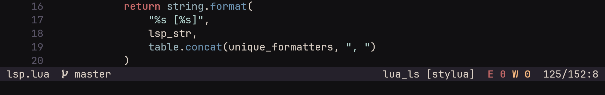

# nIM.nvim

nIM.nvim is a collection of my personal Lua utilities for Neovim,
mashed into a single plugin.

Every couple of months I decide that my workflow sucks in some minor way,
ending in config-tweaking sessions. But I got tired of managing a dozen
little files, so I bundled them here.
It’s opinionated, modular, and tries to keep things simple while
letting you tweak the source easily if you really need to.

## Setup

Install it with your favorite package manager.
You must call `.setup()` or nothing happens.

#### Example using nvim native plugin manager (>= v0.12)

```lua
-- `vim.pack` was added in v0.12 of neovim
vim.pack.add({
    { src = "https://github.com/afj8z/nIm.nvim"}
})

require("nIM").setup({
            -- You probably want to set a keymap for the file runner immediately
            run_file = { keymap = "<Leader>r" },

            -- And a trigger for the Redir command capture
            redir = { keymaps = { expand_cmd = "<C-v>" } }
        })
```

## General Configuration

You can toggle specific modules on or off and set global defaults for floating windows.

```lua
require("nIM").setup({
    -- Master switch to enable/disable modules
    enabled = {
        match_parens = true,
        run_file = true,
        redir = true,
        statusline = true,
    },

    -- Global defaults for any floating window this plugin creates
    float = {
        width = 0.8,   -- 0.0 - 1.0 (ratio) or integer (columns)
        height = 0.8,
        border = "rounded", -- "single", "double", "rounded", "solid", "shadow"
        style = "minimal",
    },

    -- Global window options applied to nIM buffers (results, output, etc.)
    style = {
        number = false,
        relativenumber = false,
        signcolumn = "no",
        wrap = false,
    },
})
```

## Modules

### 1. Match Parens

Replaces the built-in matchparen plugin. It highlights the matching bracket
and the region inside them.
**Why?** The built-in plugin often bugs out and matches brackets inside strings or
comments with ones outside. This module uses Tree-sitter to avoid that. It falls
back to regex if Tree-sitter isn't available.

#### Configuration

```lua
match_parens = {
    -- Characters to match
    pairs = {
        ["("] = ")", ["["] = "]", ["{"] = "}", ["<"] = ">",
        [")"] = "(", ["]"] = "[", ["}"] = "{", [">"] = "<",
    },
    -- Highlight groups
    hl_groups = {
        region = "BracketRegion", -- The area between brackets
        paren = "MatchParen",     -- The brackets themselves
    },
}
```

#### 2. Run File

Asynchronously executes the current file based on its filetype.
It pipes output to a buffer (not a terminal), so you can treat the output like
text (copy/paste/search). It also includes "Smart Runners" for C, C++, and
TypeScript that handle compilation or runtime detection automatically.
Note that this is not a `DAP` or `REPL`, it's utility is in being the fastest
way to run a file and read std-out without having to open a new terminal.

#### Configuration

```lua
run_file = {
    -- You MUST set this to bind a key
    keymap = nil, -- e.g., "<Leader>r"

    -- Map filetypes to commands.
    -- Can be a list {"python3"} or a function returning a command list.
    interpreters = require("nIM.interpreters").defaults,

    -- Window strategy: "splitb" (bottom), "split" (top), "vsplit" (right),
    -- "vsplitl" (left), "float", "new"
    win = "splitb",

    -- Dimensions for split/float
    win_opts = {
        width = 0.3,
        height = 0.25,
        max_height = 9,
        min_height = 3,
        border = "rounded",
    },

    -- Buffer-local keymaps for the result window
    -- Default: 'q' to close, 'd' to send diagnostics to quickfix
    buf_keymaps = {},

    -- Override global styles for this specific window
    style = { number = false },
}
```

### 3. Redir

Captures command output into a buffer.
Useful for things like `:Redir !ls -la` or `:Redir messages`.
You can also map a key to grab the current command line, execute it,
and pipe the result into a split/float.

#### Configuration

```lua
redir = {
    win = "float", -- Default window strategy

    win_opts = {
        width = 0.4,
        height = 0.5,
        border = "rounded",
    },

    style = { number = false },

    -- Plugin actions
    keymaps = {
        -- Map a key to capture the current command line
        expand_cmd = nil, -- e.g., "<C-v>"
    },

    -- Buffer local maps in the output window
    buf_keymaps = {
        { "n", "q", ":close<CR>", { desc = "Close Redir window" } },
    },
}
```

### 4. Statusline

A modular, highly configurable statusline. The focus is on super easy
customisation and extensibility. You can customise the included modules,
or define your own custom components and order, and the plugin will take care
of rendering the statusline with your style choices.
It includes modules for Git, LSP (allowing you to filter out formatters or any LSP),
Diagnostics, and file info.



> Note: The styling is kind of buggy, and not a priority of mine to fix, as
> my own setup is super minimal.

#### Configuration

```lua
statusline = {
    -- 1. Modules Configuration
    modules = {
        file = {
            path = "name", -- "name", "relative", "full"
            filetype = true,
        },
        lsp = {
            ignore_list = { "copilot", "copilot.lua" }, -- Don't count these as clients
            use_conform = false, -- If true, filters out conform.nvim formatters
            show_formatter = false, -- Show "lua_ls [stylua]"
        },
        diagnostics = {
            severity = { error = true, warn = true, hint = true, info = true },
            persist = { error = true, warn = true, hint = false, info = false }, -- Show 0 if clear?
        },
        position = {
            mode = "numbers", -- "numbers" or "percentage"
            numbers = {
                show = { line = true, total_lines = true, col = true },
                separators = { vertical = ":", line = "/", col = "/" },
            },
        },
        file_info = {
            show = { filetype = true, encoding = true, filesize = true, permissions = true },
            permissions = { short = true }, -- Show "RO" instead of "r--r--r--"
        },
        git_branch = {
            show_icon = true,
            fallback_to_hash = true, -- Show hash if detached head
        },
        mode = {
            name = "full", -- "full" (NORMAL) or "short" (N)
            colors = "rainbow", -- "mode" (standard), "rainbow" (colors), or custom table
        },
    },

    -- 2. Layout Order
    order = {
        left = { "mode", "file", "git_branch" },
        center = {},
        right = { "lsp", "diagnostics", "position" },
    },

    -- 3. Styling & Presets
    style = {
        -- Shapes: nil, "powerline", "slanted", "bubble", "block"
        preset = nil,

        -- Colors: nil, "colorblocks", "groups", "each"
        -- "colorblocks": Distinct BG per module
        -- "groups": Distinct BG per section (left/right)
        colors = nil,

        greyscale = false, -- Make everything sad and grey?

        -- Separators around modules: nil, "each", "groups"
        islands = nil,

        padding = { line = 0, modules = 1 },
    },

    icons = {
        diagnostics = { ERROR = "", WARN = "", HINT = "", INFO = "" },
    },

    -- Filetypes that force a minimal statusline
    internal_fts = { "qf", "lazy", "TelescopePrompt", "oil" },
}
```
